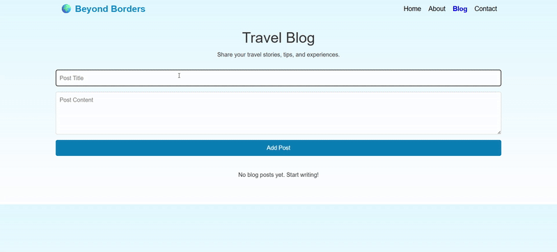

<h1>🌍 Beyond Borders – Travel Blog Website ✈️</h1>

Beyond Borders is a responsive travel blog web application built using React.js.
It allows users to explore travel stories, read curated content, and manage blog posts through a simple CRUD (Create, Read, Update, Delete) interface.

<h2>✨ Features</h2>

📝 Add, Edit, Delete Blog Posts in real-time

🎨 Responsive & Modern UI with external CSS styling

📂 Organized components for Home, About, Blog, and Contact pages

⚡ React Router for seamless page navigation

📱 Mobile-friendly design for better accessibility

💾 State management using React Hooks

<h2>🛠️ Tech Stack</h2>

Frontend: React.js, JSX, CSS

Routing: React Router DOM

State Management: useState Hook

Styling: External CSS for each page

<h2>📌 Pages</h2>

Home: Travel destination highlights and hero section

About: Information about the website and mission

Blog: CRUD operations for blog posts

Contact: Contact form and details

Watch Demo 

