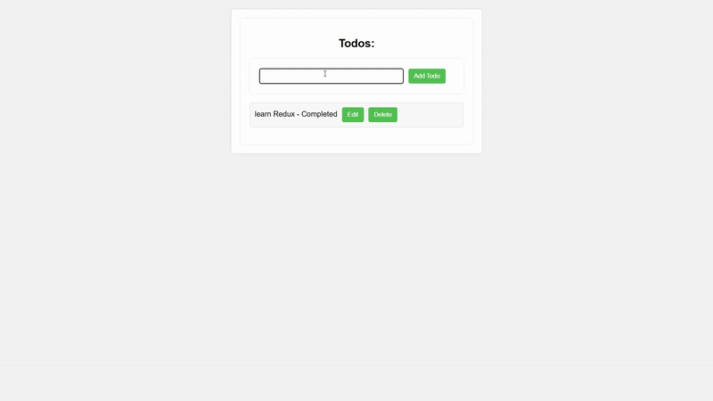

📝 Todo App

A simple and interactive task manager built with HTML, CSS, and Redux Toolkit ⚡.
Manage all your tasks with ease using a centralized Redux store, organized state, and a clean slice structure.

✨ Features:

➕ Add Todos – Create new tasks in seconds.

✅ Mark Complete – Toggle between done and pending.

❌ Delete Tasks – Remove tasks you no longer need.

🗂 Centralized Store – All data stored in one predictable location.

🧩 Slice Logic – Reducers + actions in a single clean file.

🔍 Debug Easily – Compatible with Redux DevTools.

🛠 Tech Stack:

🖥 Frontend: HTML, CSS

🗄 State Management: Redux + Redux Toolkit (createSlice, configureStore)

⚙ Core Concepts: Store, State, Actions, Reducers

Watch Demo 

